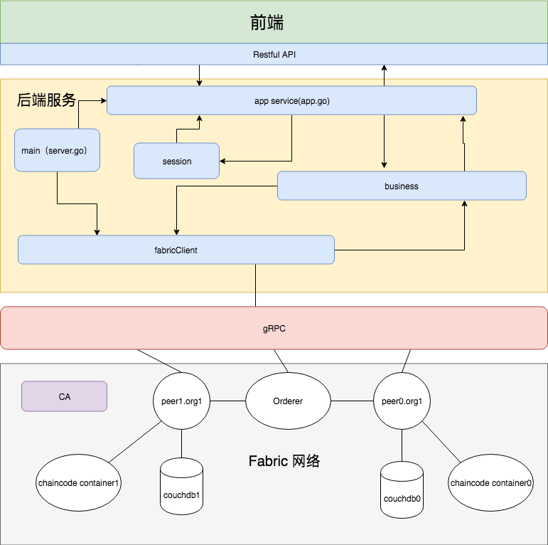

# 技术架构文档

## 项目架构说明

### 总览：

#### 前端入口：

界面展示，使用restfulAPI和后端交互

#### 后端服务

1、从入口启动，读取配置文件

2、创建fabric client等对象

3、启动app service，接收并处理前端发起的API请求

4、判断session

5、处理业务逻辑

6、数据与区块链之前的存储和查询处理

#### 底层网络

1、后端服务和底层fabric网络之前通过gPRC通信

2、底层网络的orderer、peers、couchdb、chaincode container、ca组件

