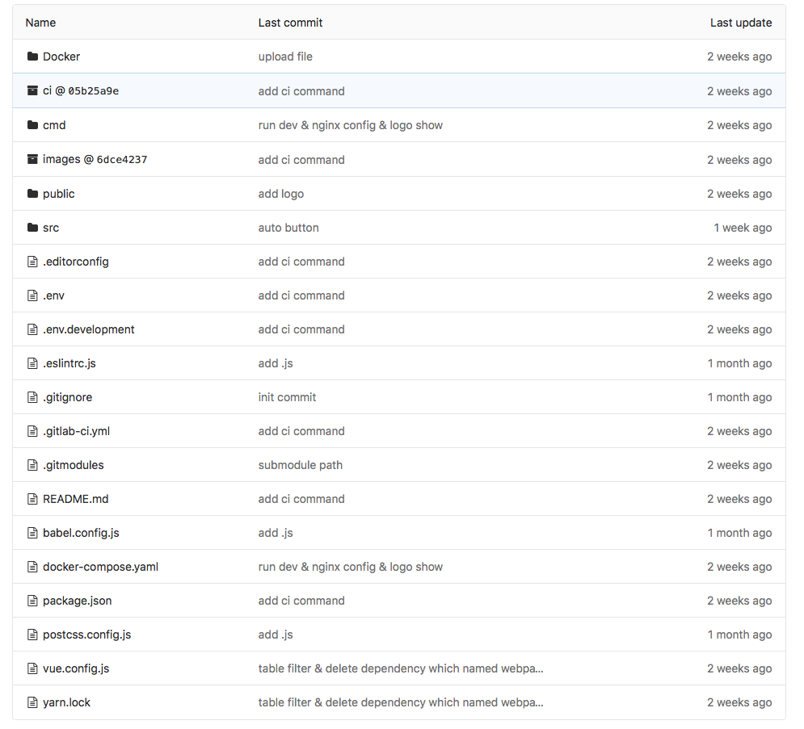

# 前端代码说明文档

## 根目录说明

* Docker — 包含nginx配置和Dockerfile
* ci — 包含ci部署执行的脚本，通过git submodule方式挂载进来
* images — 包含构建镜像的脚本，通过git submodule方式挂载进来
* cmd — 包含项目本地运行的脚本
* public — 包含了静态资源如HTML页面和图片等
* src — 包含了业务代码
* .editorconfig----
* .env — production环境配置
* .env.development — development环境配置
* .eslintrc.js — 保存要使用的代码检查器的设置
* package.json — 包含依赖，还有一些命令的快捷方式，如测试命令，预览命令和发布应用的命令
* .gitlab-ci.yml — ci 部署yml 配置文件
* .gitmodules — git module 配置
* babel.config.js — babel配置
* docker-compose.yaml — docker compose 的配置文件
* postcss.config.js — postcss 配置文件
* vue.config.js — vue下webpack配置
* yarn.lock — yarn install 后生成的lock文件

## src目录说明

* src — 包含了业务代码
* * api — 包含api 接口文件
  * assets — 包含资源文件
  * components — 包含模块、组件代码
  * icons — 包含icon 文件
  * lang —  包含语言配置
  * libs — 包含常用工具类文件
  * plugins — element-ui 按需加载配置
  * store — vuex状态管理
  * views — 页面配置
  * App.vue — 项目根组件
  * main.js — 项目入口文件
  * permission.js — 路由权限配置
  * router.js — 路由配置

